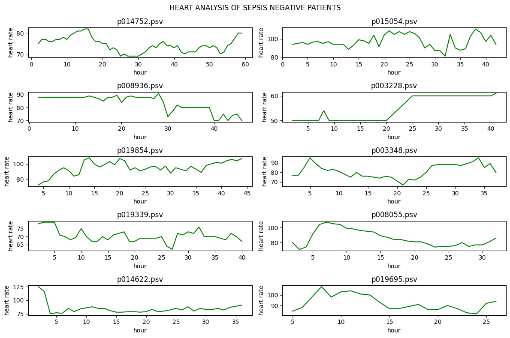
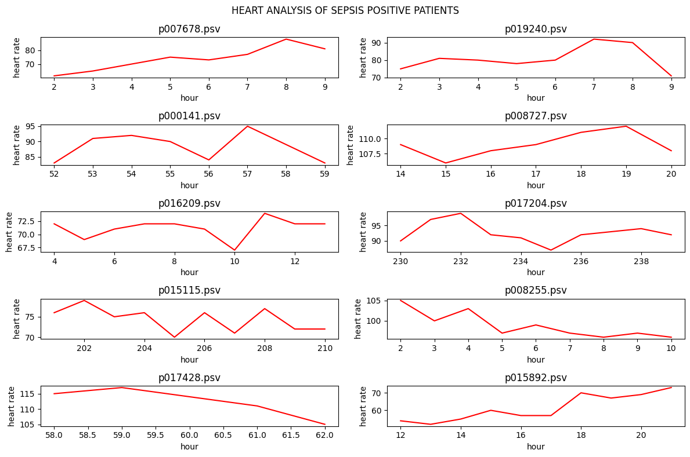
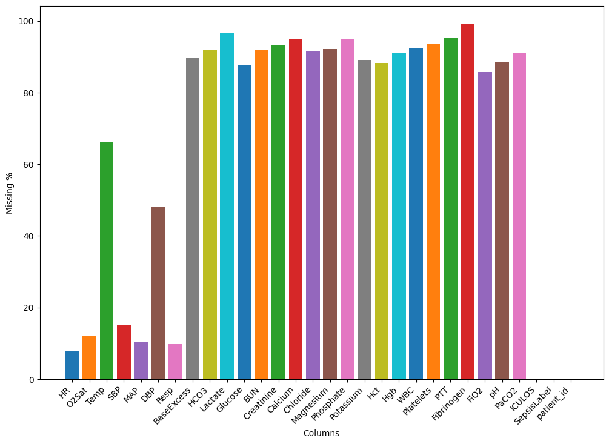
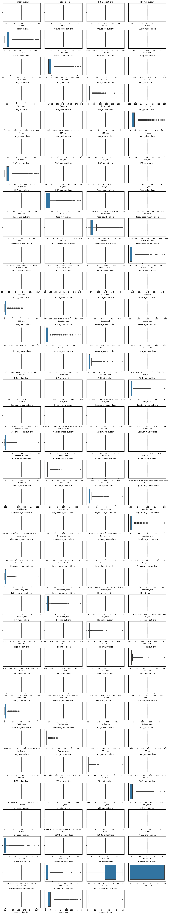
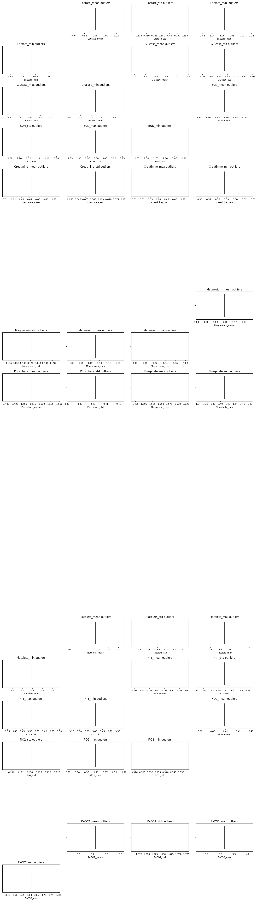
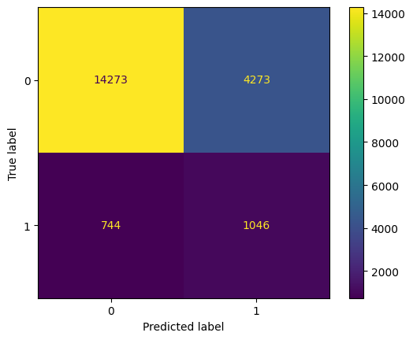
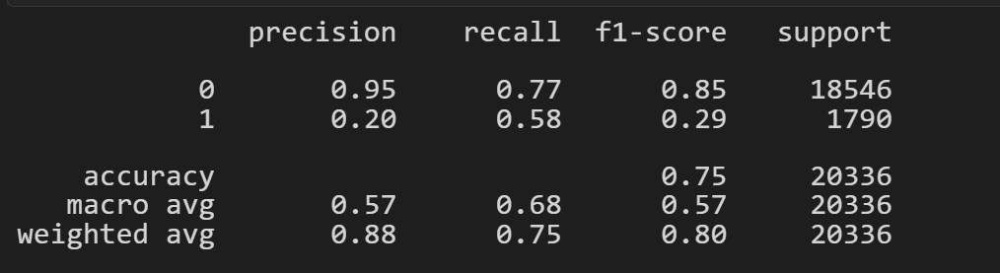
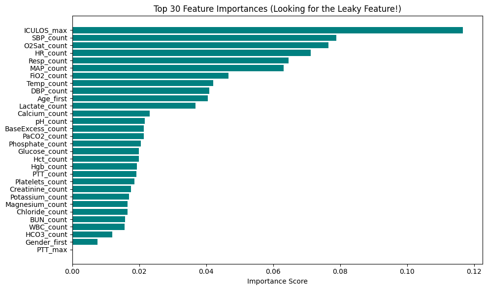

# 05/JUNE/2026

## Project Structure

This repository is organized to support the full lifecycle of an early sepsis prediction system: data ingestion, exploratory analysis, temporal feature engineering, supervised model training, calibration, explainability, evaluation, testing, and Streamlit deployment. The structure keeps experimental work in notebooks, reusable logic in `src/`, trained artifacts in `models/`, and outputs such as plots and metrics in `reports/`.

```bash
earlysepsis/
│
├── README.md
├── requirements.txt
├── .gitignore
├── .env.example
│
├── data/
│   ├── raw/
│   │   ├── training/
│   │   ├── validation/
│   │   └── sample_patient/
│   ├── interim/
│   └── processed/
│
├── notebooks/
│   ├── 01_data_understanding.ipynb
│   ├── 02_eda_missingness.ipynb
│   ├── 03_feature_engineering.ipynb
│   ├── 04_baseline_model.ipynb
│   ├── 05_boosting_model.ipynb
│   ├── 06_calibration_shap.ipynb
│   └── 07_error_analysis.ipynb
│
├── src/
│   └── earlysepsis/
│       ├── __init__.py
│       ├── data/
│       ├── features/
│       ├── models/
│       ├── evaluation/
│       ├── explainability/
│       ├── app/
│       ├── pipelines/
│       ├── utils/
│       └── config/
│
├── models/
│   ├── baseline/
│   ├── xgboost/
│   ├── calibrated/
│   └── artifacts/
│
├── reports/
│   ├── figures/
│   ├── tables/
│   └── metrics/
│
├── tests/
│   ├── test_data_loader.py
│   ├── test_features.py
│   ├── test_training.py
│   ├── test_inference.py
│   └── test_app_smoke.py
│
├── scripts/
│   ├── run_training.py
│   ├── run_inference.py
│   ├── generate_sample_input.py
│   └── export_metrics.py
│
└── deployment/
    ├── Dockerfile
    └── streamlit_config.toml
```

### Root files

- `README.md` — Main project documentation, problem motivation, setup steps, usage instructions, and results summary.  
- `requirements.txt` — Python dependencies for data processing, modeling, explainability, and Streamlit.  
- `.gitignore` — Excludes virtual environments, caches, model binaries, and local secrets from version control.  
- `.env.example` — Template for environment variables (paths, app settings, optional secrets).

### `data/`

- `data/raw/` — Original downloaded dataset files exactly as obtained from the source.  
- `data/raw/training/` — Training patient files used for model development.  
- `data/raw/validation/` — Validation split for threshold tuning, calibration, and model comparison.  
- `data/raw/sample_patient/` — Small sample patient records for debugging, demos, and app testing.  
- `data/interim/` — Intermediate artifacts such as merged hourly tables, cleaned records, or partially engineered features.  
- `data/processed/` — Final model-ready datasets after imputation, missingness features, rolling windows, deltas, and label alignment.

### `notebooks/`

- `01_data_understanding.ipynb` — Inspect dataset format, patient-level files, columns, label distribution, and clinical variable overview.  
- `02_eda_missingness.ipynb` — Explore missing values, feature sparsity, clinically meaningful absence of measurements, and class-conditional distributions.  
- `03_feature_engineering.ipynb` — Prototype temporal features (rolling stats, trends, time-since-last-measurement, etc.).  
- `04_baseline_model.ipynb` — Build and evaluate a logistic regression baseline.  
- `05_boosting_model.ipynb` — Train and tune tree-based / boosting models (RF, XGBoost, LightGBM).  
- `06_calibration_shap.ipynb` — Perform probability calibration and SHAP-based explainability.  
- `07_error_analysis.ipynb` — Investigate false positives/negatives, lead time, and subgroup performance.

### `src/earlysepsis/`

Main Python package with reusable source code.

- `__init__.py` — Makes `earlysepsis` an importable package.

#### `src/earlysepsis/data/`

- `loader.py` — Reads raw patient files, parses hourly records, returns standardized DataFrames.  
- `schema.py` — Defines expected columns, types, feature groups, and label conventions.  
- `validation.py` — Checks data quality (missing columns, invalid ranges, duplicates).  
- `split.py` — Builds patient-level train/validation/test splits to avoid leakage.

#### `src/earlysepsis/features/`

- `build_features.py` — Assembles full feature table (raw vars + rolling + trends + missingness + SOFA-like features).  
- `rolling.py` — Computes rolling statistics over recent hours.  
- `trends.py` — Computes deltas, slopes, and other trend descriptors.  
- `missingness.py` — Builds missingness flags and time-since-last-observed features.  
- `sofa.py` — Derives organ dysfunction features inspired by SOFA.

#### `src/earlysepsis/models/`

- `train_logreg.py` — Train interpretable logistic regression baseline.  
- `train_rf.py` — Train Random Forest model.  
- `train_xgb.py` — Train tree-based boosting model (e.g. XGBoost).  
- `calibrate.py` — Apply probability calibration methods.  
- `predict.py` — Load trained models and produce risk predictions.  
- `thresholding.py` — Select decision thresholds based on desired operating points.

#### `src/earlysepsis/evaluation/`

- `metrics.py` — Compute AUROC, AUPRC, sensitivity, specificity, etc.  
- `plots.py` — Create ROC/PR curves, feature importance, and other figures.  
- `calibration.py` — Assess calibration using curves and metrics.  
- `leadtime.py` — Quantify how early the model detects sepsis before onset.

#### `src/earlysepsis/explainability/`

- `shap_utils.py` — Compute and format SHAP values.  
- `clinical_text.py` — Turn model explanations into clinician-friendly text.

#### `src/earlysepsis/app/`

- `streamlit_app.py` — Main Streamlit app entrypoint.  
- `ui_components.py` — Reusable UI elements.  
- `patient_form.py` — Input form / upload interface for recent patient data.  
- `visualizations.py` — Plot risk trajectories and SHAP-based explanations in the app.

#### `src/earlysepsis/pipelines/`

- `training_pipeline.py` — Orchestrate end-to-end training.  
- `inference_pipeline.py` — Orchestrate end-to-end inference on new data.  
- `preprocess_pipeline.py` — Shared preprocessing used in both training and inference.

#### `src/earlysepsis/utils/`

- `config.py` — Load YAML/env configuration.  
- `logger.py` — Central logging configuration.  
- `paths.py` — Centralize frequently used file paths.  
- `helpers.py` — Miscellaneous helpers.

#### `src/earlysepsis/config/`

- `model_config.yaml` — Model hyperparameters and choices.  
- `feature_config.yaml` — Feature selection and window settings.  
- `app_config.yaml` — Streamlit UI and display configuration.

### `models/`

- `baseline/` — Saved logistic regression and basic models.  
- `xgboost/` — Saved boosting models and related artifacts.  
- `calibrated/` — Calibrated versions of trained models.  
- `artifacts/` — Shared components (scalers, encoders, feature lists, etc.).

### `reports/`

- `figures/` — All plots and figures.  
- `tables/` — Summary and comparison tables.  
- `metrics/` — Metric dumps (CSV/JSON) for runs.

### `tests/`

- `test_data_loader.py` — Tests for data loading and schema.  
- `test_features.py` — Tests for feature generation.  
- `test_training.py` — Tests for training logic and saved artifacts.  
- `test_inference.py` — Tests for inference on sample inputs.  
- `test_app_smoke.py` — Smoke tests to ensure the app starts.

### `scripts/`

- `run_training.py` — CLI for training pipeline.  
- `run_inference.py` — CLI for running inference on new data.  
- `generate_sample_input.py` — Generate example patient input files.  
- `export_metrics.py` — Export metrics and comparisons to `reports/`.

### `deployment/`

- `Dockerfile` — Container specification for model + app deployment.  
- `streamlit_config.toml` — Streamlit configuration (theme, port, etc.).

***

# 06/JUNE/2026

## Progress log: merging training sets

Today’s focus was on **understanding and merging the large training datasets (training Set A and Set B)** for the PhysioNet 2019 sepsis data.

- Explored the structure of `training_setA` and `training_setB`, where each `.psv` file represents one ICU patient stay with hourly observations.
- Implemented a data-loading routine in `01_data_understanding.ipynb` to:
  - Iterate over all patient files in each training folder.  
  - Read each `.psv` file with `pandas.read_csv(sep="|")`.  
  - Add `patient_id` (from the filename) and `source_set` (`"A"` or `"B"`) columns to preserve patient identity and dataset origin.  
  - Append each patient’s dataframe to a list and then **concatenate** them into a single `DataFrame` for analysis.
- Combined Set A and Set B into one merged dataframe for EDA, while still keeping the raw files separated on disk.
- Saved the merged hourly-level dataset to `data/interim/` (e.g. `all_patients.parquet`) to avoid re-reading and re-merging 40k files in later notebooks.
- Verified the merge by checking:
  - Number of unique `patient_id` values.  
  - Distribution of `source_set` (`"A"` vs `"B"`).  
  - Presence and distribution of `SepsisLabel` across patients and hours.

This gives a **single, analysis-ready dataset** spanning all training patients, with clear provenance, and will be the starting point for further EDA, missingness analysis, and feature engineering in the next steps.

***

**NOTE:** The raw data contains 1k files instead of 40k due to github restrictiion on UI processing. You can download the data from:
https://www.kaggle.com/datasets/salikhussaini49/prediction-of-sepsis

# 07/JUNE/2026
## Progress log: merged training sets A and B
On 7 June 2026, I completed merging all patient files from the two training sets:

data/raw/training/training_setA

data/raw/training/training_setB

What was done
Iterated over all .psv patient files in both folders.

Read each file with pandas.read_csv(sep="|").

Added:

patient_id (from the filename) to uniquely identify each patient.

source_set ("A" or "B") to track which set each record came from.

Concatented all patient dataframes into a two merged dataframe using pd.concat.

Saved the merged dataset to:

data/interim/merged_setA.csv
data/interim/merged_setB.csv

so that subsequent notebooks don’t need to re-read and re-merge ~40k files every time.

# 08/JUNE/2026
## Progress log: analysed heart rate in sepsis vs non-sepsis patients

On 8 June 2026, I analysed heart rate (`HR`) patterns in sepsis-positive and sepsis-negative patients to visually compare how heart rate changes across ICU stay time.

What was done

Filtered the dataset into:

- sepsis-positive patients using `SepsisLabel == 1`
- sepsis-negative patients using `SepsisLabel == 0`

Selected only rows where heart rate was available using:

```python
dfA['HR'].notna()
```

to avoid plotting missing HR values.

Randomly sampled patient IDs from both groups for visualization.

Plotted heart rate against ICU stay hours using:

- `HR` as the y-axis
- `ICULOS` as the x-axis

Used matplotlib subplots to display multiple patient graphs inside a single figure frame.

Added:

- subplot titles for each patient ID
- a main figure title using `plt.suptitle()`

Used separate visualizations for sepsis and non-sepsis patients to compare trends more clearly.

Observed that some patients did not have heart rate recorded for all ICU hours, so rows with missing HR were skipped during plotting.


This analysis serves as an exploratory step to understand whether heart rate behavior differs between sepsis and non-sepsis patients before moving to feature engineering or statistical comparison.

A sample visualization of heart rate trajectories for 10 randomly selected sepsis-negative patients is included alongside this log entry.




# 09/JUNE/2026
## Progress log: grouped attributes and reviewed missing-value percentages

On 9 June 2026, the dataset attributes were organized into clinically meaningful groups and their non-null percentages were reviewed to decide which variables should be retained for exploratory analysis and later model development.

## What was done

Grouped the dataset columns into the following categories:

- vital signs
- blood gas function
- metabolic markers
- kidney function
- liver function
- hematology
- cardiac marker
- demographics
- time and label columns

Used these groups to define a `must_keep` feature list containing:

- `vital_signs`
- `metabolic`
- `kidney_function`
- `hematology`
- `demographics`

These groups were treated as priority features because they contain core physiologic and organ-function variables relevant to sepsis assessment, such as heart rate, blood pressure, temperature, lactate, renal markers, inflammatory markers, and patient context.

Calculated the non-null percentage of each attribute using the ratio of non-missing values to total rows in the dataframe. In pandas, functions such as `notna()` are used to identify non-missing values, and this made it possible to examine feature sparsity before plotting or model preparation.

Used a filtering loop to print attributes with less than 50% non-null values that were not part of the `must_keep` list.

Corrected the membership-check logic from `x not in [must_keep]` to `x not in must_keep`, which fixed the filtering behavior and returned only the intended optional sparse attributes.

## Sparse optional attributes identified

The following attributes were found to be below 50% non-null and outside the main must-keep groups:

- `FiO2` — 14.19%
- `pH` — 11.47%
- `PaCO2` — 8.77%
- `SaO2` — 4.96%
- `AST` — 1.50%
- `Alkalinephos` — 1.46%
- `Bilirubin_direct` — 0.15%
- `Glucose` — 12.23%
- `Bilirubin_total` — 1.23%
- `TroponinI` — 0.12%

## Interpretation

This review showed that several optional laboratory and blood-gas variables are highly sparse, especially liver markers and TroponinI, while some variables such as `FiO2`, `pH`, `PaCO2`, and `Glucose` may still be worth keeping for a richer model despite low coverage.

It also confirmed that the core variables needed for early sepsis modeling should remain centered on vital signs, metabolic markers, kidney-related variables, hematology features, and demographic information, since vital sign assessment and organ dysfunction are central to sepsis evaluation in ICU settings.

## Next step

The next step is to begin EDA on the retained important variables, starting with vital signs and other must-keep features, and then decide whether the sparse optional variables should be included in the first baseline model or left for later experiments.

# 10/JUNE/2026
## Progress log: clarified patient-level modeling, missingness plotting, and EDA direction
On 10 June 2026, the work moved from feature grouping into a clearer modeling and exploratory-analysis plan. The main goal of the day was to understand how the hourly ICU records should be converted into a patient-level dataset, how missingness should be visualized, and what additional EDA tasks should be completed before baseline model training.

## What was done
Clarified that the current dataset contains multiple hourly rows for each patient, while the planned baseline machine-learning model should use one row per patient rather than one row per hour.

Understood how groupby('patient_id') works in pandas as a split-apply-combine operation that groups all rows of the same patient together and allows patient-level summaries to be computed from hourly measurements.

Defined the idea of building a new patient-level dataset by aggregating important variables such as:

HR
O2Sat
Temp
SBP
MAP
DBP
Resp
Lactate
Creatinine
BUN
WBC
Platelets
Age
Gender
HospAdmTime
Unit1
Unit2

Outlined the main summary features to calculate per patient for selected numeric variables:

mean
standard deviation
minimum
maximum
first value
last value
trend (last - first)
number of observations
missing percentage

This established the structure for a one-row-per-patient baseline table that can later be used for XGBoost or other classical machine-learning models.

## Missingness work
Worked on understanding missing-data exploration more practically instead of treating all incomplete columns as immediate drop candidates. It was recognized that ICU datasets naturally contain sparse laboratory variables and that missingness itself can later be transformed into useful features such as n_obs and missing_pct at the patient level.

Started plotting missingness percentages for selected columns using the pattern:

dfA[col].isna().mean() * 100

Used a bar-chart approach in Matplotlib to visualize missing percentages for selected features, and learned how to rotate x-axis labels and annotate bars with the exact percentage value for readability.

Also clarified that in plt.xticks(rotation=45, ha='right'), the parameter ha means horizontal alignment, which helps keep tilted column names readable when several features are shown on the x-axis.



## EDA understanding gained
Created a clearer checklist for what should still be done in EDA before modeling begins. The planned EDA now includes:

plotting missingness by column

reviewing univariate distributions of important variables

comparing sepsis vs non-sepsis groups

checking trends over ICULOS

examining correlations among key features

summarizing variables at the patient level

checking outliers

reviewing class balance and onset behavior

This made the next stage of analysis more structured and focused on the variables most relevant to the baseline model.

Dataset interpretation notes
Clarified that the Gender column is already numerically encoded in the dataset and should be treated as a binary feature in the baseline model. It was also noted that this binary encoding reflects a limitation of the available data because non-binary and other gender identities are not represented in many legacy medical datasets.

Clarified that learning RNNs or LSTMs is not necessary for the first version of the project. A baseline based on engineered patient-level features and XGBoost remains a valid and commonly used approach in early sepsis prediction research.

Research direction refined
The publication goal was discussed more directly, and it was concluded that a simple aggregate-feature model alone is unlikely to be enough for a strong paper because many studies have already explored early sepsis prediction on the PhysioNet dataset.

A more promising direction was identified: first build a strong baseline using patient-level aggregate features, then improve it with temporal or time-dependent features such as trends, slopes, window-based summaries, missingness-derived signals, and interpretability analysis.

## Next step
The next step is to complete the remaining EDA on the selected important variables, finalize the missingness plots, and then build the first patient-level aggregated dataset using groupby('patient_id').

After that, the baseline XGBoost model can be trained and evaluated, and its results can be saved as the reference point for later experiments with temporal features and research-oriented improvements.

Absolutely — you want a **README template** with clear placeholders where you can later insert images yourself. GitHub README files support relative image paths, like ``, or HTML `` tags if you want sizing control. [bytegoblin](https://bytegoblin.io/blog/how-to-add-images-to-readme-md-on-github)

Here’s a clean README draft for your **June 12 work** with image slots built in.

***

Absolutely — here is a full README draft you can use from the start, with clear places to insert images later. I’ve written it so you can keep the structure and just drop screenshots or plots into the marked spots. The confusion matrix and classification report fit naturally in the evaluation section, and GitHub-style markdown image links are the standard way to embed them. [aionlinecourse](https://www.aionlinecourse.com/blog/how-to-create-image-of-confusion-matrix-in-python)

***

# 12/JUNE/2026

## Progress log

Today I cleaned the dataset, handled missing values, inspected outliers, transformed skewed features, and trained a logistic regression model for sepsis prediction. The goal was to build a strong preprocessing pipeline and evaluate a baseline classifier on the final dataset.

## Dataset overview

I started by checking the dataframe shape, feature types, and missing values. The dataset contains lab summary features, vital-sign summary features, demographic variables, ICU stay information, and the binary sepsis label.


## Missing value handling

I separated the columns into three groups:

- Columns to drop because they were too sparse or not useful for the baseline.
- Columns to impute with median values.
- Columns to keep for later experimentation.

I dropped the very sparse `Fibrinogen_*` columns and `Unit1_first` / `Unit2_first`. For the remaining numeric columns with missing values, I used median imputation.


## Outlier inspection

I created boxplots for the features to identify skewed variables and extreme values. This showed that many lab-related features had long right tails and strong outliers, especially variables like lactate, PTT, FiO2, PaCO2, creatinine, BUN, and glucose-related features.



## Log transformation

Because logistic regression is sensitive to skewed distributions, I identified a list of heavily skewed features and applied `log1p` to them. I used `log1p` rather than plain log because it handles zero values safely.



## Feature preparation

After cleaning and transformation, I created:

- a feature list,
- a target list,
- and a final modeling dataframe for logistic regression.

This ensured that the training data was consistent and ready for the next steps.

## Logistic regression setup

The final preprocessing flow for logistic regression was:

1. Drop sparse columns.
2. Impute missing numeric values.
3. Apply log transformation to skewed features.
4. Scale features.
5. Train logistic regression.

I used logistic regression as a baseline because it is interpretable and performs well when the input is carefully prepared.

[Insert image here: model pipeline diagram or code screenshot]

## Model evaluation

After training, I evaluated the model using a confusion matrix and a classification report. The evaluation showed that the model found many positive sepsis cases, but it also produced a large number of false positives, which lowered precision for the positive class.

### Confusion matrix



### Classification report



The main results were:

- True Negatives: 14,273
- True Positives: 1,046
- False Positives: 4,273
- False Negatives: 744

This gave:
- Accuracy: 0.75
- Positive class precision: 0.20
- Positive class recall: 0.58
- Positive class F1-score: 0.29

These results suggest the model is better at catching sepsis cases than at avoiding false alarms.

## Notes from today

A few important things I learned today:

- Median imputation should be fit on the training set only.
- `log1p` is useful for skewed positive features.
- `Unit1_first` and `Unit2_first` are better treated as categorical or dropped for the baseline.
- Boxplots are very useful for spotting highly skewed lab variables.
- Accuracy alone is not enough for imbalanced classification problems.

***

# 13/June/2026
## Progress Log : From misleading to realily (The story)
Today when I trained the second baseline model the Random Forest model went from a misleading “perfect” score to a believable clinical classifier after I removed the leakage-heavy features. The first version looked miraculous, but it was really learning shortcuts from behavior-tracking variables like ICU time and measurement counts rather than true patient signal.
.png)



After cleaning the feature set, the model produced a much more realistic result: accuracy of 88.76%, minority-class precision of 43.25%, minority-class recall of 88.55%, and F1-score of 0.58. That tradeoff makes sense for an imbalanced medical dataset, where catching as many positive cases as possible is often more important than avoiding every false alarm.
.png)
.png)

The biggest lesson was that feature importance can reveal leakage when variables like ICULOS_max, *_count, and other time-dependent signals dominate the ranking. Once those were removed, the model stopped “cheating” and started showing genuine predictive power on unseen clinical data.

Next, I would tune the decision threshold, compare against logistic regression, and check PR-AUC instead of relying on accuracy alone. That will help decide whether the model is best used as a screening tool or needs further refinement before any serious use. Also extending to boosing model and deploying is the next objective.
Feeling Excited !!